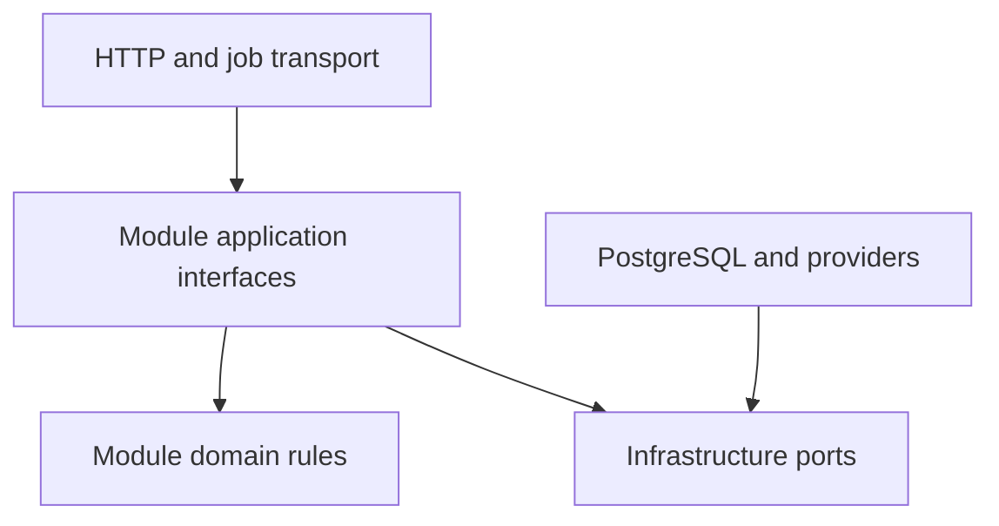

# Module boundaries

Each business module owns its schema, repository implementations, application service, and authorization decisions.

Allowed dependency direction:

Rules:

1. A module does not import another module's internal implementation.
2. A module does not query another module's tables.
3. Cross-module reads use purpose-built interfaces, not generic repositories.
4. Cross-module workflows have an explicit owning module.
5. Platform packages contain infrastructure, not business rules.
6. No `utils`, `common`, or catch-all shared business package.
7. A database foreign key may preserve integrity across ownership boundaries, but only the owning module mutates the row.

## Workspace extension

`workspace` owns learning resources, career listings, scheduled sessions, and per-member saved/completion state. It may depend on identity only. See [workspace implementation](../workspace.md).
