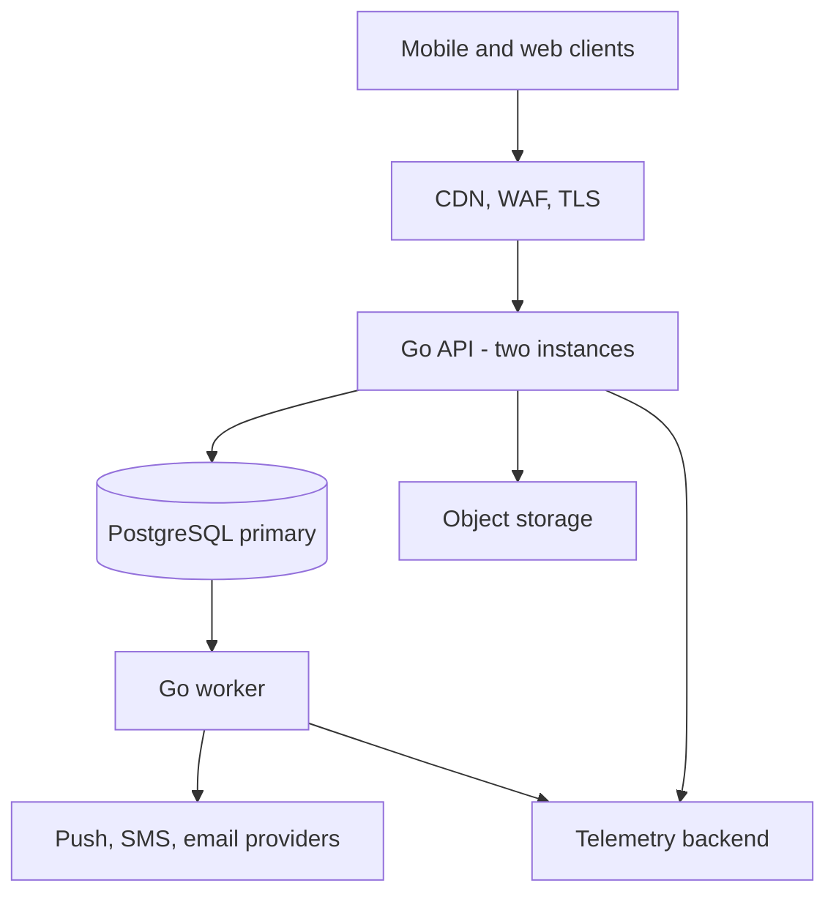
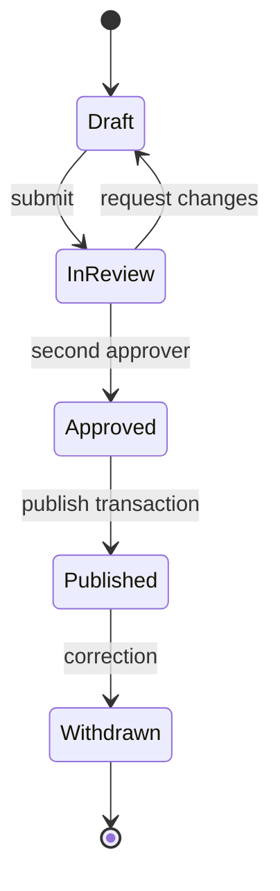

# PharmaBoard technical design

**Status:** Approved baseline v1.0
**Owner:** John Tenkorang Anim
**Last reviewed:** 25 August 2026
**Product source:** *The Pharmacy Digital Platform (PharmaBoard)*, UGPSA Policy & Innovation Team, December 2025

This document is the engineering baseline for PharmaBoard. It refines the product proposal and supersedes the earlier draft technical design. It is intentionally specific about trust, correctness, scope, and the conditions that justify architectural change.

## 1. Executive decision

PharmaBoard is not primarily another social network. It is a trusted communications rail for Ghana's pharmacy profession.

Its differentiator is the reliable, auditable delivery of official notices to verified professionals. The directory, feed, Rx Forum, and later messaging keep the network useful and active between important notices. That ordering drives the roadmap and architecture.

The first release will be a modular monolith:

- Go backend and worker
- PostgreSQL as the transactional source of truth, durable job queue, and initial search engine
- TypeScript for web and React Native mobile clients
- S3-compatible object storage for media
- OpenAPI contracts and generated client types
- OpenTelemetry-compatible traces, metrics, and structured logs

This is a robust design because it minimizes distributed failure modes while investing in the difficult parts: verified identity, two-person publication, durable delivery, offline convergence, authorization, and auditability.

## 2. Review of the supplied designs

### What was already right

The product proposal clearly identifies fragmented professional communication, a three-tab mobile experience, verified identities, official notices, the Rx Forum, directory, search, and an institution-funded sustainability model. The draft technical design improves the product thesis by making notice delivery—not generic networking—the system's center.

The following draft decisions remain:

- modular monolith before microservices;
- PostgreSQL before a fleet of specialized stores;
- transactional outbox for notice work;
- fan-out on write for notice recipients and fan-out on read for the community feed;
- no patient data;
- no machine-learned ranking in v1;
- no claim of end-to-end encrypted chat without a reviewed protocol;
- institutional and register access as launch gates.

### Corrections made in this baseline

1. **The original notice partition was invalid.** A range partition on a random UUID notice identifier has no useful time locality. At the forecast volume, no partition is needed. Partition only after measurement, by a time key designed into the table.
2. **Recipient state and transport attempts were conflated.** `notice_recipients` now records the frozen audience and human acknowledgement state; `delivery_attempts` independently records push, SMS, email, and in-app attempts.
3. **A global sequence alone is not a safe sync cursor.** Sequence allocation order is not commit order; a client can otherwise skip a late-committing transaction. The design now publishes only safe watermarks established behind a short write barrier.
4. **Publication latency was internally inconsistent.** Creating every channel attempt inside an HTTP request conflicts with the sub-second response target. The publish transaction freezes recipients and enqueues durable work; the worker creates and sends attempts.
5. **Certificate pinning was premature.** Mobile pinning creates an outage risk during certificate or key rotation. Standard platform TLS is the default; pinning requires a rotation and recovery design before adoption.
6. **Verification cannot depend on fuzzy name matching alone.** Registration number, status, and another controlled factor are required. Ambiguous matches go to manual review.
7. **Weighted professional votes need governance.** Hidden authority weighting is hard to explain and can marginalize students. Forum ranking remains transparent; accepted answers and verified credentials are displayed separately.
8. **Deletion language was too absolute.** Legal retention, security evidence, notice-delivery audit obligations, and forum integrity may conflict with immediate deletion. The final retention schedule requires Ghanaian legal review and purpose-specific rules.
9. **The schedule was too confident before prerequisites.** Dates are replaced with outcome gates. No production personal data is processed before ownership, controller, privacy, and institutional commitments are resolved.

## 3. Product boundaries

### Goals

- **G1:** A published notice is durably associated with 100% of its frozen target audience in one database transaction.
- **G2:** At least 95% of eligible active push tokens receive a provider attempt within five minutes under the planning peak.
- **G3:** Critical notices support explicit acknowledgement, escalation policy, and exportable per-recipient evidence.
- **G4:** Professional and institutional badges are based on authoritative or manually reviewed evidence and can be revoked.
- **G5:** Previously synchronized notices and followed discussions remain useful offline; queued mutations converge after reconnection.
- **G6:** A publisher can understand delivery, acknowledgement, escalation, and failure without engineering assistance.
- **G7:** A maintainer can diagnose a production incident from telemetry and runbooks without direct server access.
- **G8:** Core user flows meet WCAG 2.2 AA and work on low-bandwidth Android devices.

### Non-goals for v1

- patient, prescription, dispensing, or clinical record data;
- multi-country operation;
- microservices, Kubernetes, database sharding, or multi-region writes;
- personalized ML recommendations;
- group chat, voice, video, live presence, or typing indicators;
- end-to-end encrypted messaging;
- paid post boosting or paid polls before moderation and trust policy exist;
- self-service institutional publishing.

Chat is deferred, not silently removed from the vision. Initial direct communication can use profile contact controls or safe external handoff. In-platform messaging is reconsidered only after notices and forum demonstrate demand.

## 4. Users and critical journeys

| Actor | Primary need | Critical journey |
|---|---|---|
| Pharmacist | Trustworthy, timely information | Verify identity → receive notice → read/acknowledge → retrieve offline |
| Student | Learn and develop professional identity | Join → browse notices → ask in forum → follow experts |
| Publisher | Reach the right professional audience | Draft → preview audience → second approval → publish → audit |
| Moderator | Keep professional discourse credible | Review report → apply policy → record reason → support appeal |
| Operator | Keep delivery reliable | Observe queue/SLO → diagnose trace → retry or fail over provider |

The default mobile navigation remains **Home**, **Notices**, and **Network**. Rx Forum is reachable from Home. Notifications and profile/settings remain top-level actions. A chat surface is not reserved until messaging is approved for delivery.

## 5. Capacity model

The v1 planning ceiling is 15,000 accounts. This is deliberately higher than the early product estimate and must be replaced with authoritative counts during discovery.

| Metric | Planning value |
|---|---:|
| Accounts | 15,000 |
| Daily active users | 6,000 |
| Mean requests | 25/s |
| Normal peak | 150/s |
| Notice-open burst | 500/s for 2 minutes |
| Notices per year | 250 |
| Frozen recipient records per year | 3.75 million maximum |
| Community text records per year | <500,000 |
| Relational data, year one | <5 GB before indexes and safety factor |

A well-indexed managed PostgreSQL primary can handle this comfortably. Capacity is verified with k6 before launch. A component is added only when a measured threshold in an ADR is crossed.

## 6. System context

One source tree produces one binary with three modes:

- `pharmaboard serve`
- `pharmaboard worker`
- `pharmaboard migrate`

The API and worker deploy independently from the same immutable artifact. Database migrations use expand/contract compatibility and a separate gated job.

## 7. Language and framework choices

### Backend: Go

Go is selected for predictable latency, inexpensive concurrency, a small runtime footprint, excellent standard networking primitives, simple container images, and approachable operations. Notice fan-out is I/O-heavy; goroutines and explicit bounded worker pools fit it naturally.

The backend favors the standard library. Add `chi` only for routing ergonomics, `pgx` for PostgreSQL, and `sqlc` for generated query types. Avoid an ORM: explicit SQL matters for locking, idempotency, and delivery correctness.

### Clients: TypeScript

TypeScript gives the web console and React Native app one strict language, shares generated OpenAPI models, and makes invalid UI states harder to express. The publisher console should use a mature React framework; the mobile application should use React Native with an offline SQLite store.

### Database and contracts

SQL is treated as first-class production code. OpenAPI is the source for public request and response contracts. Generated code is checked for drift in CI once clients exist.

Rust and C++ are intentionally excluded. They would increase delivery time and reviewer scarcity without improving the forecast workload. Python remains appropriate for one-off analysis, not a production service in v1.

## 8. Module boundaries

| Module | Owns | May depend on |
|---|---|---|
| `identity` | users, credentials, sessions, devices, verification evidence | platform only |
| `notices` | drafts, approvals, audiences, recipients, delivery policy | identity interfaces |
| `community` | feed, forum, follows, reactions, moderation state | identity interfaces |
| `sync` | change log, watermarks, tombstones, device sync state | narrow export interfaces |
| `media` | upload sessions, attachment metadata, scanning state | identity interfaces |
| `admin` | publishers, moderation operations, audit events | identity, notices, community interfaces |

Modules do not query each other's tables. Cross-module work uses application interfaces and is covered by integration tests. Shared code is limited to infrastructure concerns under `internal/platform`; a generic `utils` package is prohibited.

## 9. Notice lifecycle and correctness

### State machine

Urgent and critical notices require an approver other than the author. Institutional roles are least-privilege: author, approver, publisher administrator, auditor. A single account cannot create and approve the same high-severity notice.

### Publish transaction

In one serializable business operation:

1. Lock the approved notice and verify its version and authorization.
2. Evaluate the structured audience rule against verified, eligible users.
3. Insert one `notice_recipients` row per user using a set-based `INSERT ... SELECT`.
4. Store the audience count and a canonical hash of the targeting rule.
5. Set the notice to `published` with server time.
6. Insert an idempotent `notice.dispatch` outbox job.
7. Append an administrative audit event.

If any step fails, none commits. The HTTP response means the audience and future dispatch work are durable; it does not claim that a push provider has already delivered messages.

### Dispatch and retries

Workers claim jobs using `FOR UPDATE SKIP LOCKED` with an expiring lease. Each provider request has a stable idempotency reference where supported. The system distinguishes:

- accepted by provider;
- delivered by provider callback, when supported;
- stored by the client;
- read by the user;
- explicitly acknowledged by the user.

These terms must never be collapsed into a single “delivered” metric.

Retry only errors classified as transient. Use exponential backoff with jitter and a dead-letter state after the policy limit. Provider callbacks are authenticated, replay-protected, and idempotent. A second SMS provider is exercised quarterly, not merely configured.

Escalation windows and channels are publisher policy constrained by cost caps. A critical notice may escalate to SMS when unread or unacknowledged; the policy and expected spend are previewed before final approval.

### Withdrawal

Published notices are never edited invisibly. A correction creates a new version or superseding notice. Withdrawal leaves the original delivery evidence, displays the reason, and sends a correction to the original frozen audience.

## 10. Offline synchronization

Every client mutation uses a client-generated operation ID and an `Idempotency-Key`. The server stores a request hash and response for a bounded retention window; reuse with a different payload is rejected.

### Server to client

`GET /v1/sync?after=<safe_cursor>&limit=500`

The change log is ordered by `sequence_no`, but the API exposes only a **safe watermark**. Sequence allocation alone is not safe because transactions can commit out of order. Every application write that adds change-log records takes a shared transaction advisory lock. The watermark publisher briefly takes the corresponding exclusive advisory lock, waits for in-flight writers, records the maximum committed sequence, and releases. Sync pages are bounded by that watermark. This prevents a client from advancing past a late commit.

The barrier is held only long enough to read the maximum and insert a watermark; it does not span client pagination. The implementation receives concurrency and interruption tests before use.

Tombstones are retained for 120 days initially. A client older than the retention floor receives `409 resync_required`. The full resync is resumable and media is not included inline.

### Conflict policy

| Data | Policy |
|---|---|
| Posts, comments, replies | Append-only; no merge |
| Reactions and follows | Idempotent desired state |
| Receipt timestamps | Monotonic maximum |
| Profile | Optimistic version check; field-level retry UX |
| Notice drafts | Server-owned after submission; explicit version conflict |
| Local drafts | Device-local until submitted |

## 11. Identity and verification

The Pharmacy Council states that it maintains practitioner and facility registers and provides specific data on written request. Its public portal also supports pharmacist search. Access terms and permitted matching must be agreed before implementation.

Phone-first OTP is a product hypothesis, not a permanent architectural truth. Discovery must test phone ownership, number recycling, cost, email availability, and accessibility. Authentication supports short-lived access tokens, rotated device-bound refresh tokens, session revocation, and risk-based re-verification.

Verification requires:

- registration number matched to an authorized Council source;
- active or otherwise explicitly displayed professional status;
- a second controlled factor or manual evidence review;
- recorded evidence source, reviewer, time, and reason;
- immediate badge revocation without deleting community history.

Institutional accounts require verified domain/contact evidence, TOTP or phishing-resistant MFA when supported, named individual operators, and no shared credentials.

## 12. Authorization and threat model

The highest-impact threat is a compromised publisher issuing a false critical notice. Controls are layered: strong institutional authentication, two-person approval, scoped roles, rate limits, audience and cost preview, immutable audit event, rapid withdrawal, and correction delivery.

Other primary threats:

| Threat | Required control |
|---|---|
| Account takeover | OTP throttling, token rotation, device revocation, anomaly alerts |
| Publisher impersonation | manual institution verification, named operators, MFA |
| Unauthorized audience export | default-deny authorization, audited export, watermarking |
| Scraping professional directory | rate limits, pagination caps, privacy controls, abuse monitoring |
| Malicious media | type/size validation, isolated object keys, malware scanning before publish |
| SQL injection | parameterized generated queries; no dynamic SQL from audience JSON |
| Stored XSS | sanitize Markdown, restrictive content security policy, no raw HTML |
| Provider callback forgery | signature verification, timestamp window, replay key |
| Insider audit tampering | append-only DB controls plus periodic immutable export |

An external penetration test and threat-model review gate public launch.

## 13. Privacy, compliance, and retention

Ghana's Data Protection Commission says entities processing personal data must register, and that an unregistered controller is prohibited from processing personal data. The DPC also recommends privacy policies, breach procedures, security safeguards, training, a data protection supervisor, and data-protection impact assessment practices.

Before any production personal data:

- name the legal entity, data controller, processors, IP owner, and product decision maker in signed agreements;
- register the appropriate controller/processor with the DPC;
- complete a DPIA with Ghanaian privacy counsel or an accredited practitioner;
- publish privacy and retention notices in plain language;
- execute processing agreements with hosting, telemetry, email, push, and SMS providers;
- document cross-border transfer safeguards and hosting location;
- implement access, correction, export, objection, and deletion request operations;
- establish incident response and regulator/user notification procedures.

This document is engineering guidance, not legal advice.

### Data minimization

No patient, prescription, dispensing, diagnosis, biometric, or clinical record data. Do not infer or collect precise location. Store push tokens encrypted; log only stable internal identifiers. Poll dimensions enforce a minimum reporting cell size and resist differencing attacks.

### Provisional retention schedule

| Data | Proposed retention | Final authority |
|---|---|---|
| OTP challenge | minutes, then purge | security policy |
| Idempotency response | 24 hours unless operation requires longer | reliability test |
| Device/session | until revoked plus short fraud window | privacy policy |
| Community deletion | remove or anonymize within 30 days | counsel + product policy |
| Sync tombstone | 120 days | offline test data |
| Delivery/audit evidence | purpose-specific, proposed 3–7 years | institution + counsel |
| Backups | rolling 35 days initially | recovery and privacy policy |

## 14. Search, feed, and forum

PostgreSQL full-text search with GIN indexes is sufficient for the initial corpus. Search respects authorization before ranking. Semantic search is not introduced until a validated use case, evaluation set, cost budget, and misinformation controls exist.

The feed is fan-out on read and cursor-paginated. Ranking is chronological with small, published boosts for pinned official content and recent meaningful discussion. No paid boost enters the professional feed in v1.

Rx Forum uses threaded, searchable discussion. Verification is visible context, not a hidden vote multiplier. Accepted answers are explicit and moderation actions include a reason and appeal path. Medical disclaimers do not replace moderation; patient-specific advice is prohibited.

## 15. API standards

- HTTPS JSON API under `/v1`.
- UUIDv7 generated in the application for externally visible IDs.
- Cursor pagination; no unbounded collections.
- RFC 9457 problem details for errors.
- `Idempotency-Key` required on externally initiated mutations.
- Optimistic concurrency via entity version/ETag for mutable resources.
- UTC instants in RFC 3339; human locale and time zone only at presentation.
- Explicit request size, media type, and timeout limits.
- Backward-compatible additive contract changes within a major version.
- Authorization tests for every endpoint and every role.

## 16. Performance and resilience budgets

| Path | Target at normal peak |
|---|---:|
| API availability | 99.9% monthly, excluding announced maintenance |
| Read endpoint latency | p95 <250 ms, p99 <750 ms |
| Mutating endpoint latency | p95 <500 ms, p99 <1 s |
| Publish durability response | p99 <3 s for 15,000 recipients |
| First dispatch attempt | p95 <30 s |
| Eligible push attempts | 95% within 5 min |
| Recovery point objective | <5 min |
| Recovery time objective | <60 min initially |

Budgets are hypotheses until load and restore tests establish measured baselines. Provider acceptance is not device receipt and does not count as such in SLO reporting.

Clients use compressed responses, thumbnail variants, list virtualization, skeleton states, explicit offline state, and progressive media loading. The app must be usable on a constrained Android device and a slow/intermittent network profile in CI or device testing.

## 17. Observability and operations

OpenTelemetry instrumentation begins with the first production feature. Propagate `trace_id`, `notice_id`, job ID, and provider request ID without personal data.

Primary domain signals:

- audience freeze count versus recorded audience size;
- outbox age and depth;
- provider attempt latency and classified failure rate by channel;
- client storage, read, and acknowledgement rates as separate metrics;
- sync catch-up duration, resync rate, and mutation replay failures;
- verification and moderation queue age;
- SMS spend and projected escalation cost.

Deploy an immutable container through GitHub Actions using workload identity, not long-lived cloud keys. Run migrations separately and backward compatibly. Managed PostgreSQL uses point-in-time recovery. Restore drills occur quarterly with recorded RPO/RTO evidence. Every alert links to a runbook.

## 18. Testing strategy

| Layer | Required evidence |
|---|---|
| Unit | state transitions, audience rule parser, authorization policy |
| Integration | real PostgreSQL; constraints, locking, idempotency, retries |
| Contract | OpenAPI validation and generated-client compatibility |
| Property | arbitrary audience rules and provider failure sequences preserve recipient invariants |
| Sync | late commits, disconnect at every page boundary, replay, tombstone expiry, full resync |
| Chaos | kill worker mid-batch, expire lease, provider outage, callback replay |
| Load | 10× normal peak and the 15,000-recipient publish path |
| Security | SAST/dependency/secret checks plus external pre-launch assessment |
| Accessibility | automated checks plus keyboard and screen-reader review |
| Recovery | point-in-time restore and documented service recovery |

The two highest-value invariants are:

1. A published notice's `audience_size` always equals its immutable recipient count.
2. Repeated execution, timeouts, crashes, and callbacks never lose a recipient or create an unbounded duplicate send.

## 19. Delivery roadmap

| Gate | Scope | Exit condition |
|---|---|---|
| 0. Legitimacy | ownership, controller, DPC path, Council data access, publisher commitment, user research | signed decisions and at least one committed institutional pilot |
| 1. Foundation | CI, environments, identity, authorization, verification pilot, telemetry | 50 consented pilot users; threat model reviewed |
| 2. Notice rail | compose/approve/publish, frozen audience, push, acknowledgement, audit report | real publisher sends to ≥500 pilot users; invariant and chaos tests pass |
| 3. Offline and community | safe sync, notices offline, directory, feed, Rx Forum, search | week-old client converges; 1,000 users; moderation staffed |
| 4. Hardening | SMS failover, load, accessibility, restore, penetration test, DPIA closure | SLOs measured; no unresolved critical findings |
| 5. Launch | staged national rollout | go/no-go signed by product, publisher, privacy, and operations owners |

Build order follows risk, not visual completeness. Phase 0 can stop the project cheaply if the trust and institutional prerequisites do not exist.

## 20. Architecture decision thresholds

| Decision | Current choice | Revisit when |
|---|---|---|
| Deployment shape | modular monolith | independent teams need independent release cadence or one module consumes >60% of resources |
| Primary store | PostgreSQL | a demonstrated workload cannot meet its SLO after query/index tuning |
| Job transport | PostgreSQL outbox | oldest runnable job >60 s at provisioned peak or sustained depth >10,000 |
| Search | PostgreSQL FTS | search p95 >200 ms after tuning or required ranking cannot be expressed safely |
| Feed | fan-out on read | feed p95 >150 ms after index/query/cache work |
| Database reads | primary only | sustained primary CPU >60% and lag-tolerant reads are identified |
| Delivery partitioning | unpartitioned | table or maintenance measurements show a concrete retention/query problem |
| Messaging | deferred | active users demonstrate need that external handoff cannot meet |
| E2E encryption | none claimed | messaging is approved and a reviewed protocol/library, device model, and recovery UX are funded |

## 21. Open decisions owned outside engineering

1. Legal entity, data controller, IP ownership, founder/contributor rights, and final product authority.
2. Terms and technical mechanism for Pharmacy Council verification data.
3. A named institutional pilot publisher and its approval/audit requirements.
4. Ghana SMS pricing, sender-ID approval, delivery receipt quality, and failover provider.
5. Moderation owner, service hours, standards, escalation, and appeals.
6. Validated institutional willingness to pay and which analytics are ethically acceptable.
7. Product name, trademark/domain clearance, and official institutional endorsement rules.

## 22. Source notes

- [Pharmacy Council Ghana](https://pcghana.org/) states that it maintains practitioner and facility registers and explains the written-request path for specific data.
- [Pharmacy Council public portal](https://forms.pcghana.org/) provides pharmacist and facility search; use is subject to agreed terms.
- [Ghana Data Protection Commission registration guidance](https://dataprotection.org.gh/registration/) describes controller/processor registration and the prohibition on unregistered processing.
- [Ghana DPC compliance guidance](https://dataprotection.org.gh/compliance/) describes DPIA and supervisory practices.

## Appendix A: deliberately absent infrastructure

Kafka, Redis, Elasticsearch, a graph database, microservices, sharding, Kubernetes, a service mesh, multi-region writes, ML ranking, and custom cryptography are absent by decision. Their absence is not lack of ambition. PharmaBoard's flagship quality should be visible in its correctness, clarity, user trust, and measured performance—not in the number of technologies it operates.
